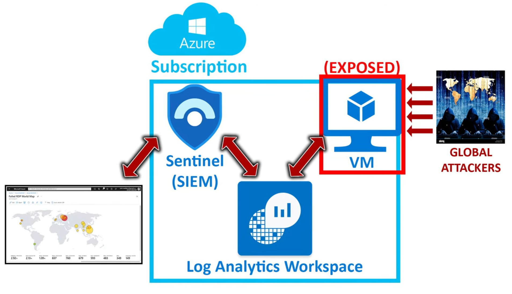

# Azure Sentinel Honeypot – Live Cyber Attack Visualization

## Table of Contents
- [Project Overview](#project-overview)
- [Technologies Used](#technologies-used)
- [Screenshots & Documentation](#screenshots--documentation)
- [Getting Started](#getting-started)
- [Step 1: Setup](setup.md)
---

## Project Overview
This project sets up a **vulnerable virtual machine (VM) in Microsoft Azure** as a honeypot to attract and log unauthorized **Remote Desktop Protocol (RDP) attacks**. Using **Azure Sentinel**, the project:

- Captures and analyzes **failed RDP login attempts**  
- Extracts **attacker IP addresses** from security logs  
- Retrieves **geolocation data** for each attacker using an API  
- **Visualizes attacks on a world map** in Azure Sentinel

### Project Architecture
The following diagram illustrates the high-level architecture of the honeypot setup:

 

## Technologies Used
- **Microsoft Azure** – Cloud platform for VM deployment and monitoring  
- **Azure Sentinel** – SIEM (Security Information and Event Management) for threat detection  
- **PowerShell** – Scripting for log extraction and automation  
- **Log Analytics Workspace** – Centralized data collection for analysis  
- **ipgeolocation.io API** – Service for geolocation lookup based on IP addresses  

## Screenshots & Documentation
As you follow along, refer to the **setup.md** and other documentation files for screenshots and configuration steps. These will include:
- **VM creation and network configuration** in Azure.  
- **Firewall settings and Log Analytics configuration**.  
- **PowerShell script execution and log extraction results**.  
- **Azure Sentinel attack visualization on a world map**.  

## Getting Started
To replicate this project:
1. **Follow setup.md** to deploy the honeypot VM in Azure.
2. **Run the PowerShell script** to extract and analyze RDP attack logs.
3. **Use Azure Sentinel** to visualize the geolocated attack data.

## Future Enhancements
Potential improvements include:
- **Automated attack detection and alerts** using Azure Sentinel rules.
- **Extending the honeypot** to monitor additional attack vectors.
- **Integrating a dashboard** for real-time attack visualization.

## Disclaimer
This project is for **educational and research purposes only**. Deploying honeypots can attract real-world attacks, so ensure that your cloud security measures are in place.

---

[🔝 Back to Table of Contents](#table-of-contents)

