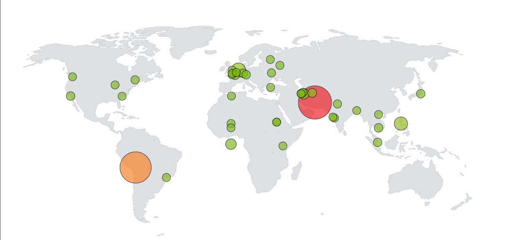

# Geolocation Visualization in Microsoft Sentinel

## Table of Contents
- [Threat Visualization in Microsoft Sentinel](#threat-visualization-in-microsoft-sentinel)
- [Conclusion](#conclusion)
- [Back to Logs Analysis](logs_analysis.md)
- [Back to Active Directory Home Lab README](README.md)

---

### Threat Visualization in Microsoft Sentinel

1. **Run the Query**:
   - Click **Run Query** to process your data.

2. **Troubleshooting**:
   - If any custom fields (**CF**) cause issues, remove the problematic field from the query and re-run the search.

3. **Set Visualization**:
   - From the **Visualization** dropdown menu, select **Map**.

4. **Configure Map Settings**:
   - Open **Map Settings** > **Layout Settings** (on the right side of the screen).
   - Under **Location Info Using**, select **longitude/latitude** (if these cause issues, try **country** or **region** as an alternative).
   - Set:
     - **Latitude**: `latitude_CF`
     - **Longitude**: `longitude_CF`

5. **Configure Metric Settings**:
   - Scroll down to **Metric Settings**.
   - Set:
     - **Metric Label**: `label_CF`
     - **Metric Value**: `event_count`

6. **Apply Settings**:
   - Click **Apply** to save the configuration.

7. **Visualize Attack Locations**:
   - Observe the map to see where your VM is being attacked from.
   - Initially, you might only see failed login attempts you made, but after some time, refresh the map to view additional attack data.

8. **Analyze Logs**:
   - Inspect the logs for details like source IP, time, country, username, and other relevant information.

**Note** 
- These logs only report failed RDP attempts. Consider exploring other logs to uncover additional potential attack types.

   

---

### Conclusion
- By following the steps outlined in this guide, you can successfully set up geolocation visualization in Microsoft Sentinel. This powerful feature allows you to track the origin of threats in real-time, providing valuable insights into potential security risks. Regularly monitor your logs and visualizations to enhance your organization's security posture and identify trends or suspicious activity. Stay vigilant and proactive in safeguarding your systems!

   

---

[🔝 Back to Table of Contents](#table-of-contents)

##

[Back to Active Directory Home Lab README](README.md)

##