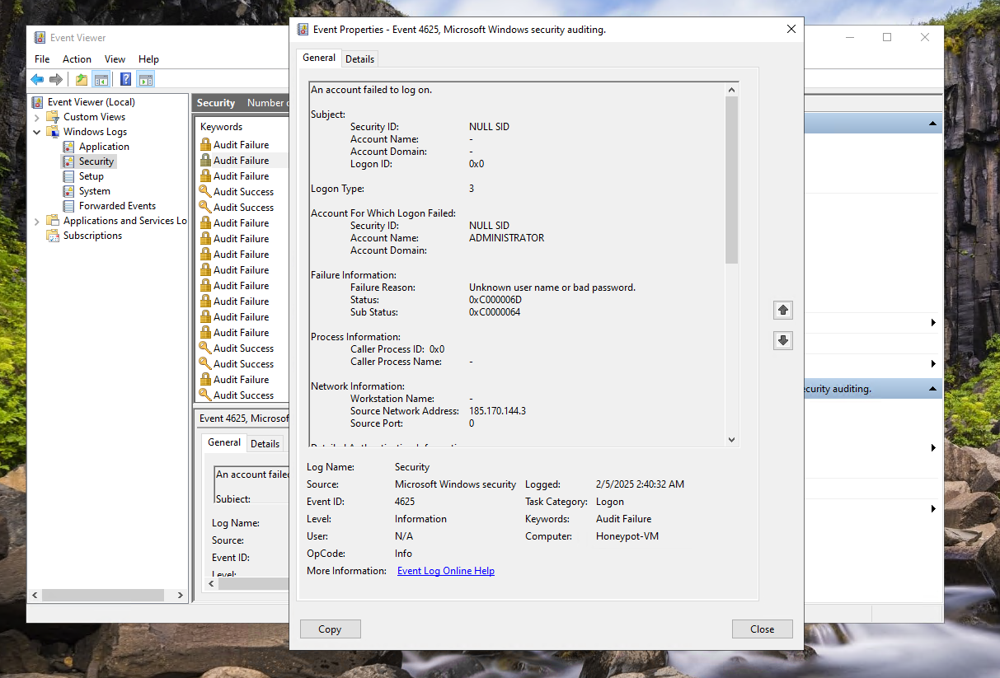
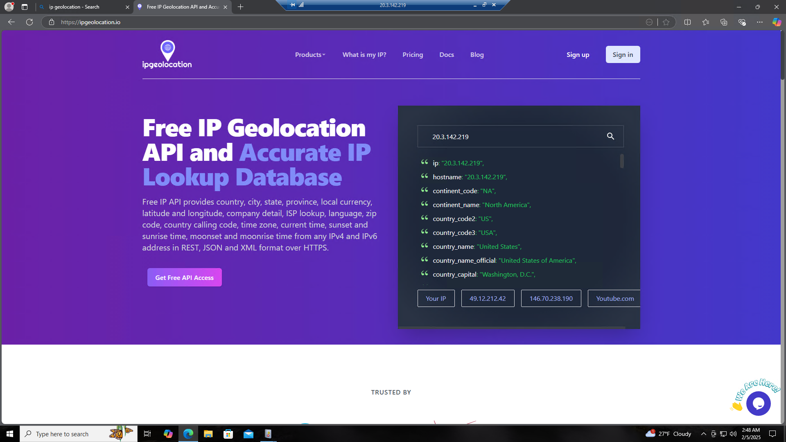
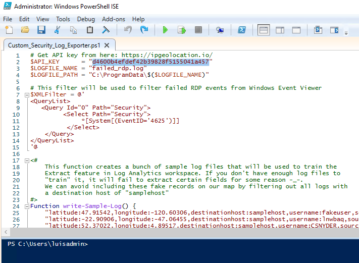

## Analyzing Security Logs in Event Viewer

### Step 1: Accessing the Event Viewer
1. On your honeypot virtual machine, open the **Event Viewer**:
   - Press `Windows Key + S` and type **Event Viewer**, then hit `Enter`.

2. Navigate to the following path in the left-hand menu:
   - **Windows Logs > Security**

3. Focus on the logs labeled **Audit Failure**:
   - These events indicate failed attempts to log into the system. Each log entry provides detailed information about the failed login attempt, including:
     - **Source Network Address**: The IP address of the machine attempting to connect.
     - **Failure Reason**: Specifies why the login failed (e.g., incorrect username or password).
     - **Event ID**: Unique identifier for the event (e.g., Event ID 4625 for failed logon attempts).

---

### Step 2: Interpreting the Event Data
Take a closer look at the details of an **Audit Failure** event:
1. **Source Network Address**: This is the IP address of the system attempting to connect to the honeypot. These IPs will later be used for geolocation mapping to identify the geographic location of the attackers.
2. **Account Name**: Indicates which account was targeted (e.g., `Administrator`).
3. **Failure Reason**: Explains why the authentication failed (e.g., "Unknown user name or bad password").

### Screenshot Reference
Below is an example of an **Audit Failure** log (Event ID 4625). Note the details that will be extracted for further analysis:
- **Source Network Address**: `185.170.144.3`
- **Event Time**: `2/5/2025, 2:40:32 AM`
- **Failure Reason**: "Unknown user name or bad password."



---

### Explanation of Audit Failures
- **What are Audit Failures?**
  - These events are logged when an attempt to log into the system fails. They are part of Windows Security Auditing and are useful for detecting unauthorized access attempts.
  - Common reasons for failures include:
    - Incorrect usernames or passwords.
    - Attempted logins from untrusted IPs or machines.
  
- **Why Focus on These Events?**
  - These logs provide critical information for identifying potential malicious activity.
  - By analyzing the IP addresses of failed logon attempts, we can gain insight into where attackers are originating from, which helps build threat intelligence.

---

### Step 3: Preparing for Data Mapping
1. Collect the **Source Network Address** (IP addresses) from multiple Audit Failure events.
2. These IP addresses will be used in subsequent steps to generate a world map visualization of attack origins.

**Next Steps**: After collecting the IP addresses, proceed to the geolocation analysis section to map these events visually.

---

## Using IP Geolocation for Tracking IP Addresses

### Step 1: Navigate to the IP Geolocation Website
1. Open a browser on your honeypot virtual machine or local system.
2. Visit the following website: [IP Geolocation](https://ipgeolocation.io).
3. Sign up for the website and get your API key that we will need to run our PowerShell script.

---

### Step 2: Understand the Purpose
The IP Geolocation website provides detailed information about IP addresses, including:
- **Location Details**: Country, state, city, latitude, and longitude.
- **Network Details**: ISP (Internet Service Provider) and hostname.
- **Additional Data**: Continent, time zone, and official country name.

This information will be used to:
1. Plot the IP addresses collected from failed login attempts in the **Event Viewer**.
2. Visualize the geographic distribution of attack sources on a world map.

---

### Step 3: Using the Website
1. On the IP Geolocation homepage:
   - Enter the **Source Network Address** (IP address) from the logs collected in the Event Viewer (e.g., `185.170.144.3`).
   - Click the search icon or press **Enter**.
2. Review the detailed information displayed for the IP address.
   - **Example**:
     - IP: `20.3.142.219`
     - Country: `United States`
     - Continent: `North America`
     - Country Capital: `Washington, D.C.`
3. Copy the data for later use in plotting the locations on a world map.

---

### Screenshot Reference
Below is an example of the IP Geolocation interface with details for an IP address:


---

### Notes
- Make sure to document the information from each IP address you analyze.
- The latitude and longitude provided will be essential for creating geolocation visualizations in later steps.

**Next Steps**: After collecting the geolocation data, proceed to the **Geolocation Visualization** section to map the attack sources.

---

## Using the Custom PowerShell Script to Analyze IP Addresses

### Step 1: Overview of the PowerShell Script
The custom PowerShell script, **Custom_Security_Log_Exporter.ps1**, is designed to:
- Extract IP addresses from Windows Security Event logs (e.g., Audit Failures).
- Parse the logs for relevant details such as time, source IP, and failure reasons.
- Export the collected data into a structured format for analysis (e.g., CSV).

You can find the script in the project repository:
[Custom_Security_Log_Exporter.ps1](https://github.com/Venom8X/Azure-Sentinel-Honeypot/blob/main/scripts/Custom_Security_Log_Exporter.ps1)

---

### Step 2: Downloading the Script
1. Open a browser on your system or VM.
2. Navigate to the GitHub repository for this project:
   [Azure-Sentinel-Honeypot Repository](https://github.com/Venom8X/Azure-Sentinel-Honeypot)
3. Locate the script in the `scripts` folder.
4. Download the script by clicking on the **Raw** button and saving it as `Custom_Security_Log_Exporter.ps1`.

---

### Step 3: Running the PowerShell Script
1. Open PowerShell as an administrator.
2. Navigate to the directory where the script is saved. Example:
   ```powershell
   cd C:\Path\To\Script
3. Execute the script by running the following command:
```powershell
.\Custom_Security_Log_Exporter.ps1
```

---

### Step 4: Output of the Script
1. First, we need to insert our API key to the script, that we got from signing up to ipgeolocation.io (the current API key in the script does not work).



2. The script will extract the following details from the Windows Security Event logs:
        --Event Time
        --Source Network Address (IP address)
        --Failure Reason
3. The output will be saved in a CSV file for further analysis.

### Notes
-Ensure that you have administrative privileges to access the Event Viewer logs.
-This script automates the process of collecting and exporting data, saving significant time and effort.
-The exported CSV file will be used in the next steps for geolocation visualization.

Next Steps: After running the script and generating the CSV file, proceed to the Geolocation Visualization section to plot the IP addresses on a world map.