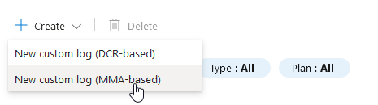

## Analyzing Security Logs in Event Viewer

## Table of Contents
- [Accessing the Event Viewer](#accessing-the-event-viewer)
- [Interpreting the Event Data](#interpreting-the-event-data)
- [Explanation of Audit Failures](#explanation-of-audit-failures)
- [Preparing for Data Mapping](#preparing-for-data-mapping)
- [Using IP Geolocation for Tracking IP Addresses](#using-ip-geolocation-for-tracking-ip-addresses)
- [Understand the Purpose](#understand-the-purpose)
- [Using the Custom PowerShell Script to Analyze IP Addresses](#using-the-custom-powershell-script-to-analyze-ip-addresses)
- [Downloading the Script](#downloading-the-script)
- [Running the PowerShell Script](#running-the-powershell-script)
- [Output of the Script](#output-of-the-script)
- [Creating Custom Logs in Log Analytics Workspace](#creating-custom-logs-in-log-analytics-workspace)
- [Extracting Geo-Data from Sample Logs](#extracting-geo-data-from-sample-logs)
- [Extract Fields from Logs](#extract-fields-from-logs)
- [Extract Longitude from Logs](#extract-longitude-from-logs)
- [Extract Remaining Fields from Logs](#extract-remaining-fields-from-logs)
- [Setting Up a Map in Microsoft Sentinel](#setting-up-a-map-in-microsoft-sentinel)
- [Next Step: Geolocation Visualization](geolocation_visualization.md)
- [Back to Setup](setup.md)
- [Back to Active Directory Home Lab README](README.md)

### Accessing the Event Viewer
1. On your honeypot virtual machine, open the **Event Viewer**:
   - Press `Windows Key + S` and type **Event Viewer**, then hit `Enter`.

2. Navigate to the following path in the left-hand menu:
   - **Windows Logs > Security**

3. Focus on the logs labeled **Audit Failure**:
   - These events indicate failed attempts to log into the system. Each log entry provides detailed information about the failed login attempt, including:
     - **Source Network Address**: The IP address of the machine attempting to connect.
     - **Failure Reason**: Specifies why the login failed (e.g., incorrect username or password).
     - **Event ID**: Unique identifier for the event (e.g., Event ID 4625 for failed logon attempts).

---

### Interpreting the Event Data
Take a closer look at the details of an **Audit Failure** event:
1. **Source Network Address**: This is the IP address of the system attempting to connect to the honeypot. These IPs will later be used for geolocation mapping to identify the geographic location of the attackers.
2. **Account Name**: Indicates which account was targeted (e.g., `Administrator`).
3. **Failure Reason**: Explains why the authentication failed (e.g., "Unknown user name or bad password").

Below is an example of an **Audit Failure** log (Event ID 4625). Note the details that will be extracted for further analysis:
- **Source Network Address**: `185.170.144.3`
- **Event Time**: `2/5/2025, 2:40:32 AM`
- **Failure Reason**: "Unknown user name or bad password."


---

### Explanation of Audit Failures
- **What are Audit Failures?**
  - These events are logged when an attempt to log into the system fails. They are part of Windows Security Auditing and are useful for detecting unauthorized access attempts.
  - Common reasons for failures include:
    - Incorrect usernames or passwords.
    - Attempted logins from untrusted IPs or machines.
  
- **Why Focus on These Events?**
  - These logs provide critical information for identifying potential malicious activity.
  - By analyzing the IP addresses of failed logon attempts, we can gain insight into where attackers are originating from, which helps build threat intelligence.

---

### Preparing for Data Mapping
1. Collect the **Source Network Address** (IP addresses) from multiple Audit Failure events.
2. These IP addresses will be used in subsequent steps to generate a world map visualization of attack origins.

**Next Steps**: After collecting the IP addresses, proceed to the geolocation analysis section to map these events visually.

---

### Using IP Geolocation for Tracking IP Addresses
1. Open a browser on your honeypot virtual machine or local system.
2. Visit the following website: [IP Geolocation](https://ipgeolocation.io).
3. Sign up for the website and get your API key that we will need to run our PowerShell script.


---

### Understand the Purpose
The IP Geolocation website provides detailed information about IP addresses, including:
1. **Location Details**: Country, state, city, latitude, and longitude.
2. **Network Details**: ISP (Internet Service Provider) and hostname.
3. **Additional Data**: Continent, time zone, and official country name.

This information will be used to:
1. Plot the IP addresses collected from failed login attempts in the **Event Viewer**.
2. Visualize the geographic distribution of attack sources on a world map.

---

### Using the Custom PowerShell Script to Analyze IP Addresses
The custom PowerShell script, **Custom_Security_Log_Exporter.ps1**, is designed to:
- Extract IP addresses from Windows Security Event logs (e.g., Audit Failures).
- Parse the logs for relevant details such as time, source IP, and failure reasons.
- Export the collected data into a structured format for analysis (e.g., CSV).

You can find the script in the project repository

---

### Downloading the Script
1. Open a browser on your system or VM.
2. Navigate to the GitHub repository for this project and download the PowerShell script called Custom_Security_Log_Explorer.ps1.
3. Download the script by clicking on the **Raw** button and saving it as `Custom_Security_Log_Exporter.ps1`.

---

### Running the PowerShell Script
1. Open PowerShell as an administrator.
2. Navigate to the directory where the script is saved. Example:
   ```powershell
   cd C:\Path\To\Script
3. Execute the script by running the following command:
   ```powershell
   .\Custom_Security_Log_Exporter.ps1
   ```

---

### Output of the Script
1. First, we need to insert our API key to the script, that we got from signing up to ipgeolocation.io (the current API key in the script does not work).


2. The script will extract the following details from the Windows Security Event logs:
        --Event Time
        --Source Network Address (IP address)
        --Failure Reason
3. The output will be saved in a CSV file for further analysis.

### Notes
-Make sure that you have administrative privileges to access the Event Viewer logs.
-This script automates the process of collecting and exporting data, saving significant time and effort.
-The exported CSV file will be used in the next steps for geolocation visualization.
-The exported CSV file will be output into the ProgramData folder which is hidden, so access it by manually typing in, `C:\ProgramData` into the File Explorer address bar and press `Enter`.

---

### Creating Custom Logs in Log Analytics Workspace
1. **Access Log Analytics Workspace**
   - Navigate to your Log Analytics Workspace in Azure.
   - Use the search bar and type `tables`, then click on **Tables** under Settings.

   

2. **Initiate Custom Log Creation**
   - Click the **+ Create** button at the top and select **New custom log (MMA-based)**.

   

3. **Upload a Sample Log**
   - On the "Sample" page, upload a sample of your custom log file (e.g., `failed_rdp.log`).
   - This file will be used to define the structure of the custom log.

   

4. **Define Record Delimiter**
   - Configure how log records are separated in the file. Ensure this matches the structure of your log file.

5. **Specify Collection Path**
   - Under "Collection paths," define where the agent should find the log file.
   - Example: `C:\ProgramData\failed_rdp.log`.

   

6. **Set Log Details**
   - Provide a unique name for the custom log (e.g., `FAILED_RDP_WITH_GEO_CL`).
   - Optionally, add a description for better identification.

   

7. **Review and Create**
   - Review the configuration and click **Create** to deploy the custom log.

---

### Extract Geo-Data from Sample Logs
1. Navigate to the **Log Analytics workspace** for your VM.
2. Open the **FAILED_RDP_WITH_GEO_CL** table to view the sample logs.
3. Locate the `RawData` column, which contains details like:
   - Longitude
   - Latitude
   - Destination host
   - Other relevant information
4. Categorize and extract values for longitude, latitude, destination host, and any other required data from the `RawData` column.
   - This step prepares the data for obtaining geolocation insights.
5. Update the **Time range** filter at the top of the workspace if you're resuming this lab after a break, to ensure you see recent data.

> **Note**: Use the `RawData` column as the source for geolocation attributes.

   

---

### Extract Fields from Logs
1. Right-click on the first log entry you see in the search results within the **FAILED_RDP_WITH_GEO_CL** table.
2. Select **Extract Fields** from the context menu.
3. In the **Main Example** view:
   - Highlight the **value of latitude** (e.g., the number), not the word "latitude" itself.
4. A pop-up window will appear:
   - Under **Field value**, type `latitude`.
   - Under **Field type**, select `numeric`.
5. Click **Extract**.
6. On the right-hand side, verify that the SIEM is correctly identifying the latitude values for all sample logs.
7. Once verified, click **Save Extraction** to store the field for future use.

   

---

### Extract Longitude from Logs
1. Repeat the same process as in Step 7, but for the **longitude** value:
   - Right-click on the same log and select **Extract Fields**.
   - Highlight the **value of longitude** (e.g., the number), not the word "longitude" itself.
2. In the pop-up window:
   - Under **Field value**, type `longitude`.
   - Under **Field type**, select `numeric`.
   - Click **Extract**.
3. If the SIEM incorrectly highlights **latitude** instead of **longitude**:
   - Click the **pencil icon** at the top-right of the incorrect highlight.
   - Select **Modify this highlight** and highlight the correct **longitude value** again.
   - Re-enter the **Field value** as `longitude` and the **Field type** as `numeric`.
   - Click **Extract**.
4. Verify the search results to ensure the SIEM is now highlighting the correct **longitude values**.
5. Continue training the SIEM by correcting a few more results, if necessary.

   

---

### Extract Remaining Fields from Logs
1. Follow the same process as in Steps 7 and 8 to extract additional values:
   - **Right-click the same log** and select **Extract Fields**.
   - Highlight each value listed below, ensuring the correct **Field title** and **Field type** are selected:
     - Highlight **destination host value** > Field title: `destinationhost` > Field type: `text`
     - Highlight **user name value** > Field title: `username` > Field type: `text`
     - Highlight **source host value** > Field title: `sourcehost` > Field type: `text`
     - Highlight **state value** > Field title: `state` > Field type: `text`
     - Highlight **country value** > Field title: `country` > Field type: `text`
     - Highlight **label value** > Field title: `label` > Field type: `text`
     - Highlight **timestamp value** > Field title: `timestamp` > Field type: `Date/Time`
2. **Re-select values if needed** and click **Save** after extracting each field. Note that you can only select and save one value at a time.
3. After extracting all fields, click **Save Extraction** for the final time.
4. Navigate to **Settings** > **Custom Logs** > **Custom Fields** in the menu on the left.
5. Verify that your custom fields match the ones extracted during this step.

   

---

### Set up a Map within Microsoft Sentinel

1. Navigate to **Microsoft Sentinel** from the Azure portal.
2. Select your workspace (**law-honeypot1**) and go to the **Threat Management** section.
3. Click on **Workbooks** and then click **+ Add workbook**.
4. In the new workbook, click **Edit**, then click the **"..."** menu on the right side of the screen, and remove the two widgets displayed by default.
5. Click **Add** > **Add query**.
6. In the query editor, paste the following query:

   ```kusto
   FAILED_RDP_WITH_GEO_CL 
   | summarize event_count=count() by sourcehost_CF, latitude_CF, longitude_CF, country_CF, label_CF, destinationhost_CF 
   | where destinationhost_CF != "samplehost" 
   | where sourcehost_CF != ""
```

7.Adjust the Time Range in the query settings to Last 24 Hours or the desired timeframe.
8.Click Run Query to execute the query.

### Explanation
- This query processes failed RDP logs and extracts location data from the custom fields (latitude, longitude, etc.) you previously configured.
- The filters at the end of the query (where destinationhost_CF != "samplehost" and where sourcehost_CF != "") ensure only meaningful results are displayed by excluding placeholder or blank values.

   

---

[🔝 Back to Table of Contents](#table-of-contents)

##
[Next Step: Geolocation Visualization](geolocation_visualization.md)

[Back to Active Directory Home Lab README](README.md)
##