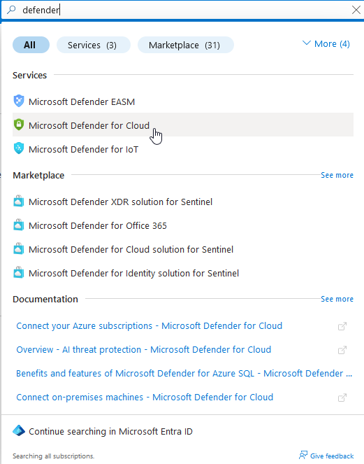

# Azure Honeypot Setup Guide

## Table of Contents
1. [Create an Azure Account](#1-create-an-azure-account)
2. [Deploy the Virtual Machine (VM)](#2-deploy-the-virtual-machine-vm)
    - [Navigate to Virtual Machines](#navigate-to-virtual-machines)
    - [Configure the VM](#configure-the-vm)
    - [Configure Administrator Account](#configure-administrator-account)
    - [Configure Network Settings](#configure-network-settings)
    - [Review and Create](#review-and-create)
3. [Create Logs Analytics Workspaces](#3-create-logs-analytics-workspaces)
4. [Configuring Microsoft Defender for Cloud](#4-configuring-microsoft-defender-for-cloud)
5. [Connecting the Honeypot VM to Sentinel](#5-connecting-the-honeypot-vm-to-sentinel)
6. [Disable Windows Firewall](#6-disable-windows-firewall)

---

## 1. Create an Azure Account
1. Navigate to [Microsoft Azure](https://azure.microsoft.com/).
2. Sign up for a free account or log in to your existing account.
3. Ensure you have an active subscription.

---

## 2. Deploy the Virtual Machine (VM)

### Navigate to Virtual Machines
1. In the Azure Portal, select **Virtual Machines** in the left-hand menu.
2. Click **Create** and choose **Azure Virtual Machine**.

---

### Configure the VM
- **Resource Group**: Create a new group (e.g., `Honeypot-RG`).
- **VM Name**: Specify a name (e.g., `honeypot-vm`).
- **Region**: Choose a region near you (e.g., `West US 2`).
- **Image**: Select **Windows 10 Pro**.
- **Size**: Use an appropriate size (e.g., `Standard_B1s`).

---

### Configure Administrator Account
- **Username**: Set a name (e.g., `luisadmin`).
- **Password**: Create a strong password.

---

### Configure Network Settings
1. Under **NIC network security group**, select **Advanced**.
2. Click **Create new**, and configure:
   - Remove the default inbound rule.
   - Add a new inbound rule:
     - **Destination port ranges**: `*`
     - **Priority**: `100`
   - Save and name the rule.

  

**Note**: These settings expose the VM to capture unauthorized access attempts.

---

### Review and Create
1. Validate the configuration and click **Create** to deploy.

---

## 3. Create Logs Analytics Workspaces
1. Search for **Log Analytics Workspaces** in the Azure Portal.

  

2. Click **Review + Create** and fill in:
   - **Subscription**: Use your active subscription.
   - **Resource Group**: Select `Honeypot-RG`.
   - **Name**: Set a name (e.g., `LAW-Honeypot`).
   - **Region**: Choose a location (e.g., `West US 2`).
3. Click **Review + Create**, then **Create**.

**Note**: This workspace serves as the hub for storing, analyzing, and querying honeypot log data.

---

## 4. Configuring Microsoft Defender for Cloud
1. Search for **Microsoft Defender for Cloud** in the Azure Portal and open it.

2. Navigate to **Environment settings** and locate your workspace (e.g., `LAW-Honeypot`).

  

3. Enable **Defender Plans**:
   - Toggle **Servers**: `On`
   - Set **SQL Servers**: `Off` (to avoid costs).

4. Configure **Data Collection**:
   - Select **All Events** for comprehensive logging.
   - Click **Save**.

---

## 5. Connecting the Honeypot VM to Sentinel
1. Open **Microsoft Sentinel** from the Azure Portal search.

2. Click **Create Microsoft Sentinel** and select your workspace (e.g., `LAW-Honeypot`).
3. Complete the setup and verify Sentinel is linked to your workspace.

  

---

## 6. Disable Windows Firewall

### Access the VM
1. Use RDP to connect to the VM.
2. Log in with the administrator credentials.

### Disable the Firewall
1. Open **Windows Defender Firewall** settings.
2. Disable both **Public** and **Private** firewalls.

---

This revised version ensures a consistent and professional structure, with clear sectioning and explanations for each step. Let me know if you'd like further tweaks or additions! 🚀
